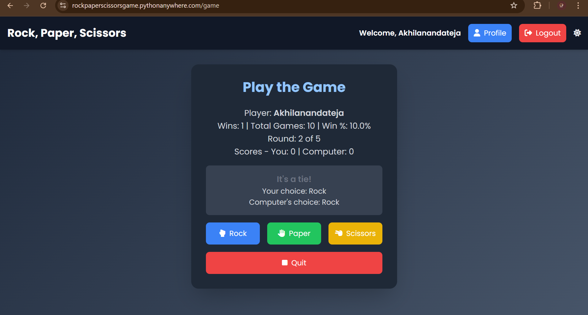

<b>Rock, Paper, Scissors Web Game</b>

A Flask-based web application for playing Rock, Paper, Scissors against the computer. Features user authentication (signup, login, guest play), customizable rounds, and a detailed profile page with game stats and history. Styled with Tailwind CSS and Font Awesome for a sleek, responsive design. 

Key Features: 
1.User Authentication: Sign up, log in, or play as a guest. 
2.Gameplay: Choose from 3 to 100 rounds and compete against the computer. 
3.Profile Stats: View wins, win percentage, win streak, win/loss ratio, and recent games. 
4.Responsive Design: Built with Tailwind CSS and Font Awesome for a modern UI. 
5.Database: Uses SQLite (Flask-SQLAlchemy) with plans to migrate to MySQL. 

Planned Enhancements: 
1.Pagination for game history. 
2.Leaderboard to showcase top players. 
3.MySQL migration for scalability. 

🌐Website link: https://rockpaperscissorsgame.pythonanywhere.com/ 

